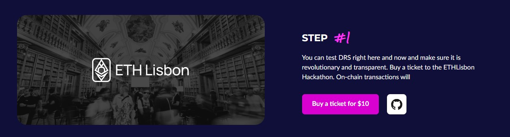
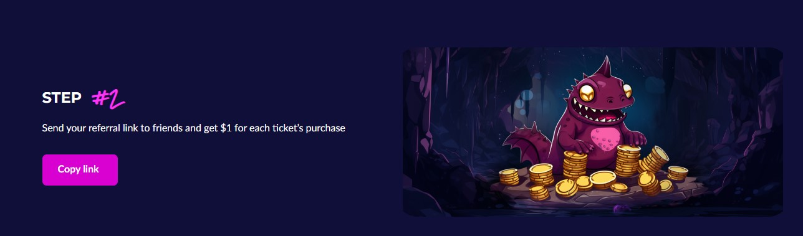
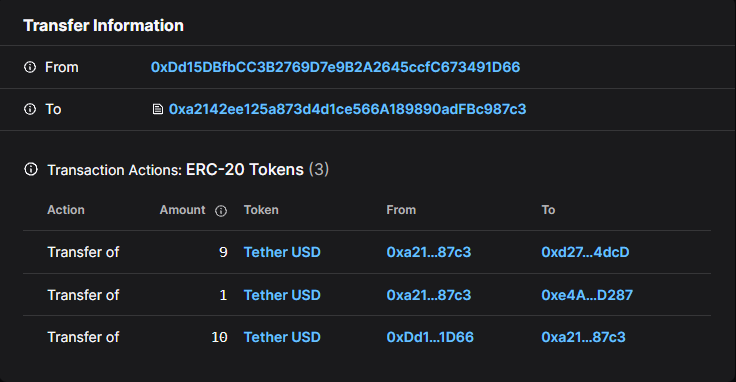

# Decentralized Referral System (DRS)
The Decentralized Referral System (DRS) is a unique and transparent referral system that is completely decentralized and allows you to track referrals instantly by paying rewards in your smart contract. 
This means that the program participants are guaranteed and will immediately receive 10% of the commission fees paid by the invited user.

* Smart payments
: Payments are made by smart contracts automatically after each user transaction to a non-custodial wallet.

* Transparency
: NO SCAM ANYMORE! All transactions are completely transparent and guaranteed through the use of smart contracts.

* Earning Opportunity
: Users can earn real money by inviting new friends or users.

# How it works
## Implementation example for ETH Lisbon ticket sale
You can test DRS right here and now and make sure it is revolutionary and transparent.
1. Go to the web page: https://theoldcastle.xyz/drs
2. Buy a ticket to the ETH Lisbon event to log in to the system;

<figure><figcaption></figcaption></figure>

3. Copy your referral link (It looks like this: https://theoldcastle.xyz/?referral=[your_referral_id];

<figure><figcaption></figcaption></figure>

4. Share the referral link to get 10% for each user transaction.

<figure><figcaption>Example of the referral reward payment <a href="https://subnets-test.avax.network/en/beam/tx/0xcfe3301b68822280d67e1574465476a170bb6e041a4bcff304a386d60b3f4de1">transaction</a> when your friends invest.</figcaption></figure>

**When the invited user buys a ticket for $10, you will receive $1**

## Implementation examples for The Old Castle Defense
### Example 1:
1. Alice sends her referral link to her friend Bob;
2. Bob follows the link and logs in;
3. Bob performs a $1,000 transaction;
4. The smart contract takes a commission of 6% from $1,000, that is $60;
5. Of this $60, the smart contract sends 10% (i.e. $6) directly to Alice's wallet;

### Example 2:
1. Alice sends a referral link to her 1,000 followers on the blog;
2. Each subscriber performs a $500 transaction;
3. The smart contract takes a commission of 6% from every $500, that is $30;
4. Alice receives 10% of this commission, i.e. $3, in her wallet;
5. In total, Alice received $3,000 with the help of DRS.

# DRS flexibility
1. You can use DRS in any of your projects!
2. Adjust the percentage of remuneration for invited users!
3. Run DRS on any blockchain!
4. Call it whatever you want. Perhaps it's more convenient for you to call it an "on-chain cashback system" or "Decentralized Referral Protocol"?
